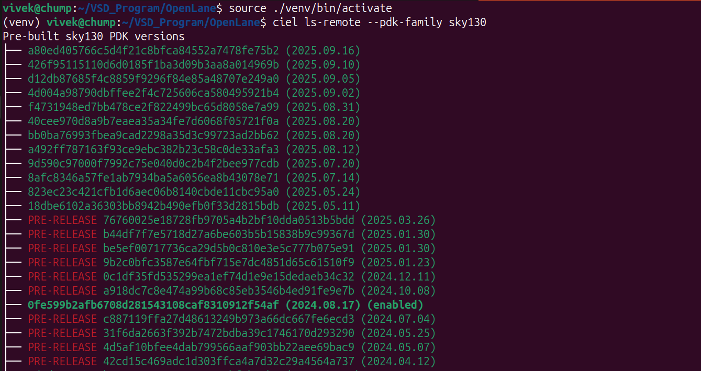
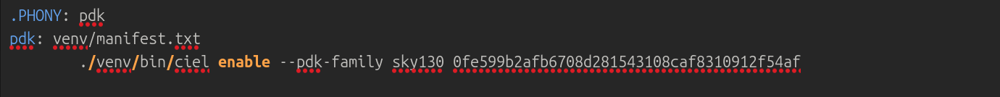

### **Step 1: Verify Prerequisites**

<div align="center">

| Tool | Purpose | Check Command |
|------|---------|---------------|
| 🔧 **Git** | Version control | `git --version` |
| 🐳 **Docker** | Containerization | `docker --version` |
| 🐍 **Python3** | Scripting | `python3 --version` |
| 📦 **Pip** | Package manager | `python3 -m pip --version` |
| 🛠️ **Make** | Build automation | `make --version` |
| 🔧 **Venv** | Virtual environments | `python3 -m venv -h` |

</div>

Ensure the following tools are installed:
```bash
$ git --version
$ docker --version
$ python3 --version
$ python3 -m pip --version
$ make --version
$ python3 -m venv -h
```

### **Step 2: Update & Install Required Packages**
```bash
$ sudo apt-get update
$ sudo apt-get upgrade
$ sudo apt install -y build-essential python3 python3-venv python3-pip python3-tk curl make git
```

### **Step 3: Certain necessary steps to ensure the 'make' command in step-4 works as intended**
```
In case, you run into VERSION errors and need to know the recent version of the PDK, make use of following commands within your virtual environment.

$ source ./venv/bin/activate
$ ciel ls-remote --pdk-family sky130
$ ./venv/bin/ciel enable --pdk-family sky130 a80ed405766c5d4f21c8bfca84552a7478fe75b2        # This enables the specific version. In this case, 'a80ed405766c5d4f21c8bfca84552a7478fe75b2'.
```

```
The PDK was tested on version: 0fe599b2afb6708d281543108caf8310912f54af.
Therefore, in the 'makefile' within OpenLANE directory certain changes needs to be made. This is as follows-
```


### **Step 4: Clone and Build OpenLane**
```bash
$ cd $HOME
$ git clone https://github.com/The-OpenROAD-Project/OpenLane
$ cd OpenLane

MAKE SURE TO FOLLOW STEP-3 AND SET THE APPROPIATE PDK VERSION. THEN CONTINUE WITH 'make' command.

$ make
$ make test
```
<div align="center">

✅ **OpenLane Successfully Installed**

</div>


---

<div align="center">

## 🎉 **Installation Complete!**

### **Verification Commands**

```bash
# Test Docker
docker --version

# Test OpenLane
cd $HOME/OpenLane
make test
```

| Component | Status | Version Check |
|-----------|--------|---------------|
| 🐳 **Docker** | ✅ Ready | `docker --version` |
| 🧰 **OpenLane** | ✅ Ready | `cd OpenLane && make test` |

### 🚀 **Ready for RTL-to-GDSII Flow!**

</div>

---

<div align="center">

### 📚 **Useful Resources**

[](https://openlane.readthedocs.io/)
[](https://docs.docker.com/)
[](https://docs.microsoft.com/en-us/windows/wsl/)

</div>

---

> 💡 **Next Steps:** You're now ready to run OpenLane flows for your digital designs! Check
