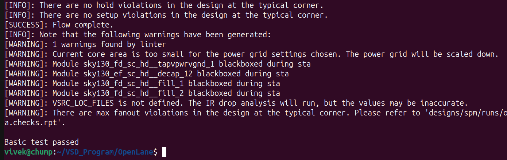

### **Step 1: Verify Prerequisites**

<div align="center">

| Tool | Purpose | Check Command |
|------|---------|---------------|
| 🔧 **Git** | Version control | `git --version` |
| 🐳 **Docker** | Containerization | `docker --version` |
| 🐍 **Python3** | Scripting | `python3 --version` |
| 📦 **Pip** | Package manager | `python3 -m pip --version` |
| 🛠️ **Make** | Build automation | `make --version` |
| 🔧 **Venv** | Virtual environments | `python3 -m venv -h` |

</div>

Ensure the following tools are installed:
```bash
git --version
docker --version
python3 --version
python3 -m pip --version
make --version
python3 -m venv -h
```

### **Step 2: Update & Install Required Packages**
```bash
sudo apt-get update
sudo apt-get upgrade
sudo apt install -y build-essential python3 python3-venv python3-pip python3-tk curl make git
```

### **Step 3: Clone and Build OpenLane**
```bash
cd $HOME
git clone https://github.com/The-OpenROAD-Project/OpenLane
cd OpenLane
make
make test
```
<div align="center">

✅ **OpenLane Successfully Installed**

</div>



---

<div align="center">

## 🎉 **Installation Complete!**

### **Verification Commands**

```bash
# Test Docker
docker --version

# Test OpenLane
cd $HOME/OpenLane
make test
```

| Component | Status | Version Check |
|-----------|--------|---------------|
| 🐳 **Docker** | ✅ Ready | `docker --version` |
| 🧰 **OpenLane** | ✅ Ready | `cd OpenLane && make test` |

### 🚀 **Ready for RTL-to-GDSII Flow!**

</div>

---

<div align="center">

### 📚 **Useful Resources**

[](https://openlane.readthedocs.io/)
[](https://docs.docker.com/)
[](https://docs.microsoft.com/en-us/windows/wsl/)

</div>

---

> 💡 **Next Steps:** You're now ready to run OpenLane flows for your digital designs! Check
