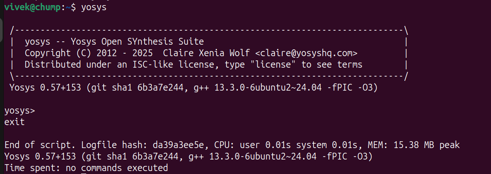
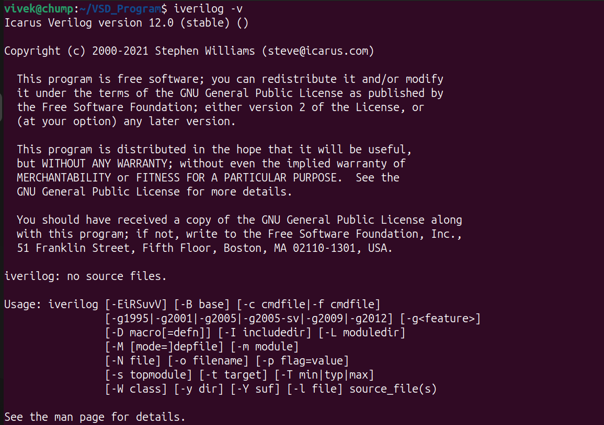
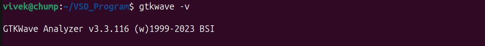
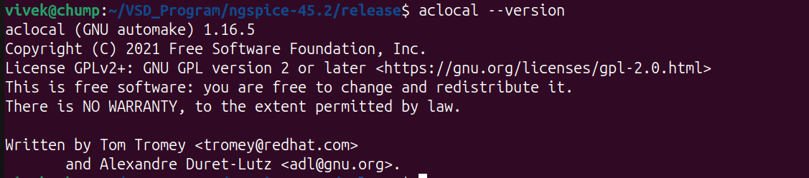
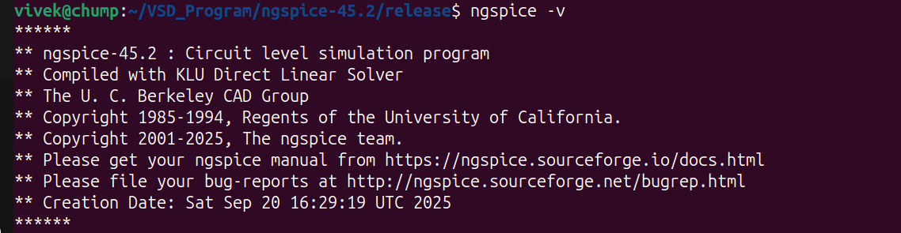

# RISC-V Reference SoC Tapeout Program VSD

## Tools Installation

#### <ins>All the instructions for installation of required tools can be found here:</ins>

### **System Requirements**
- 6 GB RAM
- 50 GB HDD
- Ubuntu 20.04 or higher
- 4 vCPU

### **TOOL CHECK**

#### <ins>**Yosys**</ins>
```bash
$ sudo apt-get update
$ git clone https://github.com/YosysHQ/yosys.git
$ cd yosys
$ sudo apt install make               # If make is not installed
$ sudo apt-get install build-essential clang bison flex \
    libreadline-dev gawk tcl-dev libffi-dev git \
    graphviz xdot pkg-config python3 libboost-system-dev \
    libboost-python-dev libboost-filesystem-dev zlib1g-dev
$ make config-gcc
# Yosys build depends on a Git submodule called abc, which hasn't been initialized yet. You need to run the following command before running make
$ git submodule update --init --recursive
$ make 
$ sudo make install
```



#### <ins>**Iverilog**</ins>
```bash
$ sudo apt-get update
$ sudo apt-get install iverilog
```


#### <ins>**gtkwave**</ins>
```bash
$ sudo apt-get update
$ sudo apt install gtkwave
```


#### <ins>**ngspice**</ins>
```bash
After downloading the tarball from https://sourceforge.net/projects/ngspice/files/ to a local
directory, unpack it using 'Extract To' button.

$ cd ngspice-45.2
$ mkdir release
$ cd release              
$ ../configure --with-x --with-readline=yes --disable-debug
# (Error 1) - Your system doesn’t have aclocal-1.16 (Automake), and the build is trying to regenerate aclocal.m4. Install automake 1.16 (plus autoconf, m4, perl) to fix it. You need to tun the following commands before running 'make'.
$ sudo apt update
$ sudo apt install automake autoconf libtool m4 perl
$ aclocal --version
$ make
$ sudo make install
```
#### **Error 1**


#### **Solution 1**




This completes the NgSpice installation.

