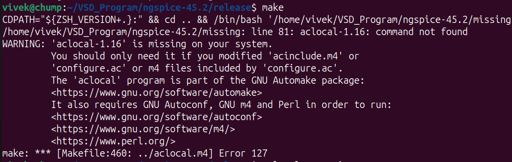
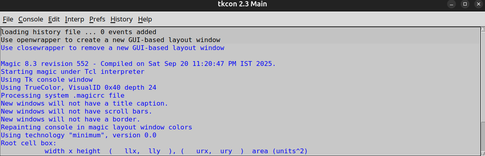
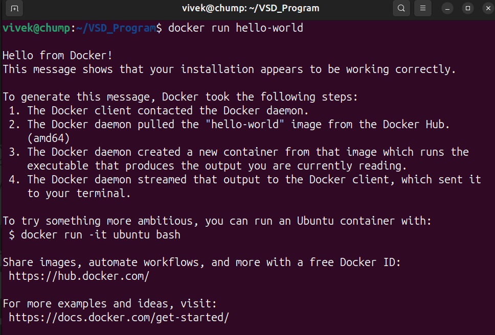

# RISC-V Reference SoC Tapeout Program VSD

## Tools Installation

#### <ins>All the instructions for installation of required tools can be found here:</ins>

### **System Requirements**
- 6 GB RAM
- 50 GB HDD
- Ubuntu 20.04 or higher
- 4 vCPU

### **TOOL CHECK**

#### <ins>**Yosys**</ins>
```bash
$ sudo apt-get update
$ git clone https://github.com/YosysHQ/yosys.git
$ cd yosys
$ sudo apt install make               # If make is not installed
$ sudo apt-get install build-essential clang bison flex \
    libreadline-dev gawk tcl-dev libffi-dev git \
    graphviz xdot pkg-config python3 libboost-system-dev \
    libboost-python-dev libboost-filesystem-dev zlib1g-dev
$ make config-gcc
# Yosys build depends on a Git submodule called abc, which hasn't been initialized yet. You need to run the following command before running make
$ git submodule update --init --recursive
$ make 
$ sudo make install
```


#### <ins>**Iverilog**</ins>
```bash
$ sudo apt-get update
$ sudo apt-get install iverilog
```


#### <ins>**gtkwave**</ins>
```bash
$ sudo apt-get update
$ sudo apt install gtkwave
```


#### <ins>**ngspice**</ins>
```bash
After downloading the tarball from https://sourceforge.net/projects/ngspice/files/ to a local
directory, unpack it using 'Extract To' button.

$ cd ngspice-45.2
$ mkdir release
$ cd release              
$ ../configure --with-x --with-readline=yes --disable-debug
# (Error 1) - Your system doesn’t have aclocal-1.16 (Automake), and the build is trying to regenerate aclocal.m4. Install automake 1.16 (plus autoconf, m4, perl) to fix it. You need to tun the following commands before running 'make'.
$ sudo apt update
$ sudo apt install automake autoconf libtool m4 perl
$ aclocal --version
$ make
$ sudo make install
```


#### **Error 1**


#### **Solution 1**


#### <ins>**Magic**</ins>
```bash
$ sudo apt-get install m4
$ sudo apt-get install tcsh
$ sudo apt-get install csh
$ sudo apt-get install libx11-dev
$ sudo apt-get install tcl-dev tk-dev
$ sudo apt-get install libcairo2-dev
$ sudo apt-get install mesa-common-dev libglu1-mesa-dev
$ sudo apt-get install libncurses-dev
$ git clone https://github.com/RTimothyEdwards/magic
$ cd magic
$ ./configure
$ make
$ sudo make install        #(Perform 'sudo make install' instead of just 'make install'. This will help you avoid running into 'permission related' errors.)
```


#### <ins>**OpenLANE**</ins>
```bash
$ sudo apt-get update
$ sudo apt-get upgrade
$ sudo apt install -y build-essential python3 python3-venv python3-pip make git
$ sudo apt install -y ca-certificates curl gnupg lsb-release
$ sudo mkdir -p /etc/apt/keyrings
$ curl -fsSL https://download.docker.com/linux/ubuntu/gpg | \
  sudo gpg --dearmor -o /etc/apt/keyrings/docker.gpg

$ echo \
  "deb [arch=$(dpkg --print-architecture) signed-by=/etc/apt/keyrings/docker.gpg] \
  https://download.docker.com/linux/ubuntu \
  $(lsb_release -cs) stable" | \
  sudo tee /etc/apt/sources.list.d/docker.list > /dev/null

$ sudo apt update
$ sudo apt install -y docker-ce docker-ce-cli containerd.io docker-buildx-plugin docker-compose-plugin
$ sudo docker run hello-world
$ sudo groupadd docker
$ sudo usermod -aG docker $USER
$ sudo reboot                        # After reboot
$ docker run hello-world
```

