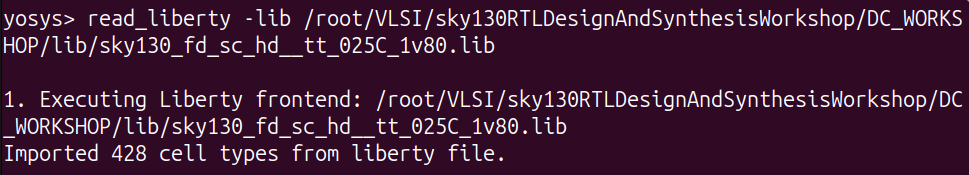
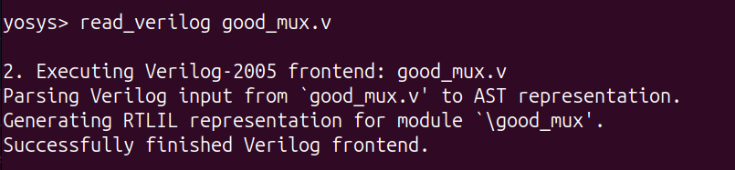
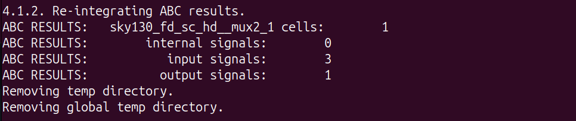
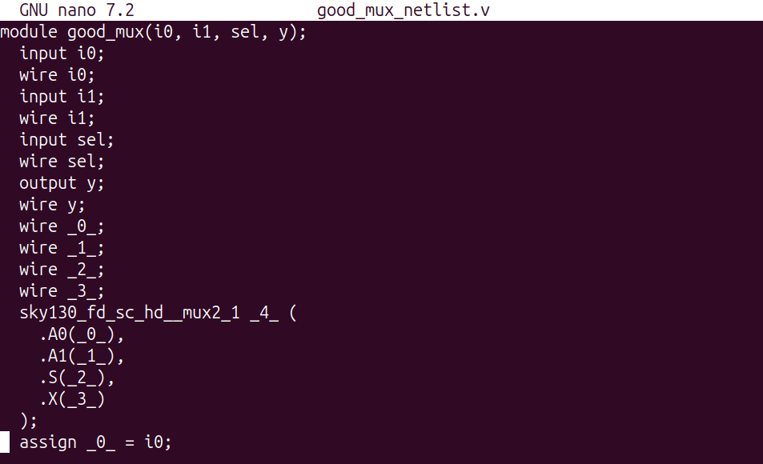

# 🔬 VLSI Design Labs

---

<details>
<summary>🧪 LAB 1 - Simulating a 2-to-1 Multiplexer</summary>

---

## 🔹 Simulation using Icarus Verilog & GTKWave

```bash
$ sudo -i
$ mkdir VLSI
$ cd VLSI
$ git clone https://github.com/kunalg123/sky130RTLDesignAndSynthesisWorkshop.git
$ ls            # You should see a folder named 'sky130RTLDesignAndSynthesisWorkshop'
$ cd sky130RTLDesignAndSynthesisWorkshop/DC_WORKSHOP/

# To run the Iverilog simulator, use the following command:
$ iverilog good_mux.v tb_good_mux.v

# You should see './a.out' file after running 'ls' command.

$ ./a.out        # Gives the follwoing output: VCD info: dumpfile tb_good_mux.vcd opened for output.

# To view the waveform using GTKWave, use the following command:
$ gtkwave tb_good_mux.vcd
```


---
<div align="center"> 
   <br/> 
  <em>GTKWave simulator success message</em> 
</div>


---
<div align="center"> 
   <br/> 
  <em>Waveform output in GTKWave</em> 
</div>

---

## 🔹 LAB work with Yosys

```bash
$ yosys

yosys> read_liberty -lib path to your .lib file

yosys> read_verilog good_mux.v    # To read the verilog module

yosys> synth -top good_mux        # To synthesize the top module

yosys> abc -liberty /root/VLSI/sky130RTLDesignAndSynthesisWorkshop/DC_WORKSHOP/lib/sky130_fd_sc_hd__tt_025C_1v80.lib
                                  # To generate the netlist. This command maps the RTL code to standard cells in the '.lib' file.

yosys> write_verilog -noattr good_mux_netlist.v
                                  # To view the clean generated netlist file.
```


<div align="center"> 
   <br/> 
  <em>Reading .lib file</em> 
</div>

---

<div align="center"> 
   <br/> 
  <em>Reading .v file</em> 
</div>

---

<div align="center"> 
   <br/> 
  <em>Generating netlist</em> 
</div>

---

<div align="center"> 
   <br/> 
  <em>Viewing netlist file</em> 
</div>

---
</details>


<details> <summary>🧪 LAB 2 - Placeholder</summary>
